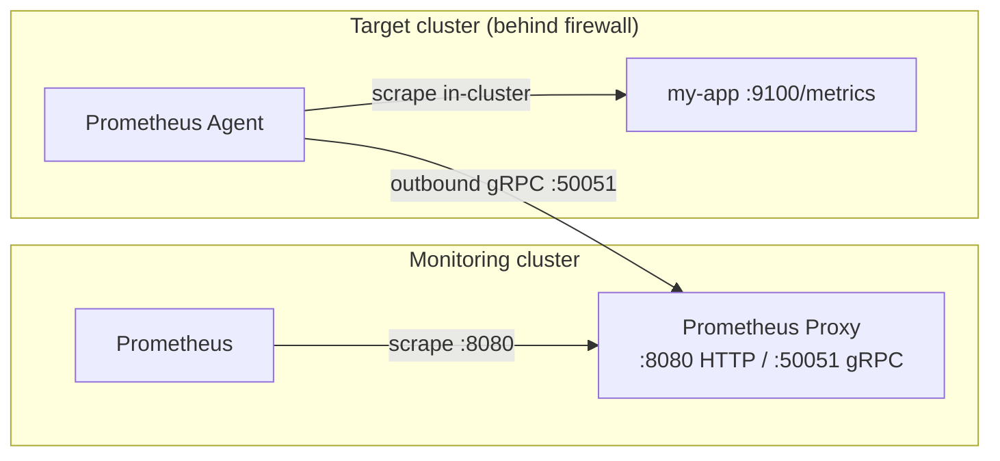

# Kubernetes

Run Prometheus Proxy on Kubernetes to scrape metrics from services that live inside
firewalled or private clusters.

## Topology

The two components play different roles, and that determines where each one runs:

- The **agent** runs **inside** each target cluster, alongside the services it scrapes. It
  opens an **outbound** gRPC connection to the proxy, so the target cluster never needs an
  inbound firewall rule.
- The **proxy** runs **centrally**, next to Prometheus. Agents dial *in* to it on the gRPC
  port (`50051`), and Prometheus scrapes it on the HTTP port (`8080`).



The agent always initiates the connection, so a target cluster only needs **egress** to the
proxy's gRPC endpoint — no inbound ports are exposed.

!!! note "Namespaces in these examples"

    The manifests below put the proxy in a `monitoring` namespace and the agent in `default`.
    Adjust the `namespace` fields and the in-cluster DNS names (e.g.
    `prometheus-proxy.monitoring.svc.cluster.local`) to match your own layout.

## Deploying the Proxy

Deploy the proxy as a `Deployment` plus a `Service`. Admin and metrics endpoints are enabled
through environment variables so Kubernetes can probe them and Prometheus can scrape them.

```yaml
--8<-- "KubernetesExamples.txt:proxy-deployment"
```

The `Service` above is a `ClusterIP`, which is enough when Prometheus and the agents live in
the same cluster. Prometheus reaches the proxy at
`prometheus-proxy.monitoring.svc.cluster.local:8080`, and same-cluster agents can use the same
DNS name for the gRPC port.

### Exposing gRPC to remote agents

When agents run in **other** clusters, they need to reach the proxy's gRPC port from outside.
Expose it with a `LoadBalancer` Service (or an Ingress controller):

```yaml
--8<-- "KubernetesExamples.txt:proxy-expose-grpc"
```

!!! warning "gRPC needs HTTP/2 end to end"

    gRPC runs over HTTP/2. A plain `LoadBalancer` (L4) forwards it transparently. If you put
    an Ingress in front instead, it must support HTTP/2 / gRPC backends (for example, the
    NGINX Ingress `nginx.ingress.kubernetes.io/backend-protocol: GRPC` annotation). Terminate
    or pass through TLS as described under [TLS](#tls).

## Deploying the Agent

The agent's path mappings live in a `ConfigMap`. The proxy hostname is supplied separately
through the `PROXY_HOSTNAME` environment variable, so the same config works regardless of
where the proxy is exposed.

```yaml
--8<-- "KubernetesExamples.txt:agent-config"
```

Each entry in `pathConfigs` maps a proxy `path` (what Prometheus scrapes) to the in-cluster
`url` the agent fetches from. Point `url` at a Kubernetes Service DNS name such as
`http://my-app.default.svc.cluster.local:8080/metrics`.

### Standalone Deployment

The common pattern is a single agent Deployment per cluster that scrapes several in-cluster
endpoints:

```yaml
--8<-- "KubernetesExamples.txt:agent-deployment"
```

Set `PROXY_HOSTNAME` to the proxy's externally reachable address (the `LoadBalancer` host from
[above](#exposing-grpc-to-remote-agents)), including the gRPC port if it is not the default
`50051`.

### Sidecar

Alternatively, run the agent as a sidecar next to a single application pod and scrape it over
`localhost`:

```yaml
--8<-- "KubernetesExamples.txt:agent-sidecar"
```

With the sidecar pattern the agent's `url` should point at `http://localhost:9100/metrics`
rather than a Service DNS name.

!!! tip "Native sidecar containers"

    On Kubernetes 1.29+ you can run the agent as a native sidecar — an entry in
    `initContainers` with `restartPolicy: Always` — so it starts before the app container and
    is tracked by the pod's lifecycle. The plain multi-container form above works on all
    versions.

## Prometheus Integration

Prometheus scrapes the **proxy**, using the agent `path` as the `metrics_path`. The path must
match the `path` value from the agent `ConfigMap`.

=== "Scrape config"

    Add a job to `prometheus.yml` pointing at the proxy Service:

    ```yaml
    --8<-- "KubernetesExamples.txt:prometheus-scrape"
    ```

=== "ServiceMonitor (Operator)"

    If you run the Prometheus Operator (e.g. `kube-prometheus-stack`), use a `ServiceMonitor`
    instead:

    ```yaml
    --8<-- "KubernetesExamples.txt:servicemonitor"
    ```

    The `release` label must match your Prometheus instance's `serviceMonitorSelector`. Add
    one entry under `endpoints` for each registered proxy path.

!!! tip "Dynamic path discovery"

    Rather than listing every path by hand, enable the proxy's service-discovery endpoint and
    let Prometheus pull the target list with `http_sd_config`. See
    [Service Discovery](service-discovery.md).

## TLS

To secure the proxy ↔ agent gRPC channel, bundle your certificates into a `Secret` and mount
it into the proxy and agent containers:

```bash
--8<-- "KubernetesExamples.txt:tls-secret"
```

```yaml
--8<-- "KubernetesExamples.txt:tls-mount"
```

The mounted config (`tls.conf`) references the certificate paths under `/app/certs`. See
[TLS Setup](security/tls.md) for the full configuration, including mutual authentication.

## Health Probes & Resources

The proxy and agent Deployments above wire Kubernetes probes to the admin endpoints:

| Probe        | Endpoint       | Meaning                                  |
|:-------------|:---------------|:-----------------------------------------|
| `livenessProbe`  | `GET /ping`        | Returns `pong` while the process is up   |
| `readinessProbe` | `GET /healthcheck` | Returns health status; non-200 if unhealthy |

Both endpoints are served on the **admin** port (`8092` for the proxy, `8093` for the agent),
which requires `ADMIN_ENABLED=true`. The manifests also set conservative CPU/memory
`requests` and `limits` — tune them to your scrape volume and payload sizes.

!!! info "No official Helm chart"

    Prometheus Proxy does not currently publish a Helm chart. The raw manifests on this page
    are the supported way to deploy on Kubernetes; adapt them to Kustomize or your own chart
    as needed.

## Next Steps

<div class="grid cards" markdown>

-   :material-robot:{ .lg .middle } __Agent Configuration__

    ---

    Path configs, HTTP client tuning, and scrape options

    [:octicons-arrow-right-24: Agent Configuration](configuration/agent.md)

-   :material-shield-lock:{ .lg .middle } __Security & TLS__

    ---

    Secure the proxy-agent channel with TLS and mutual authentication

    [:octicons-arrow-right-24: Security](security/index.md)

-   :material-radar:{ .lg .middle } __Service Discovery__

    ---

    Let Prometheus discover proxied targets dynamically

    [:octicons-arrow-right-24: Service Discovery](service-discovery.md)

-   :material-activity:{ .lg .middle } __Monitoring__

    ---

    Scrape the proxy's and agent's own operational metrics

    [:octicons-arrow-right-24: Monitoring](monitoring.md)

</div>
